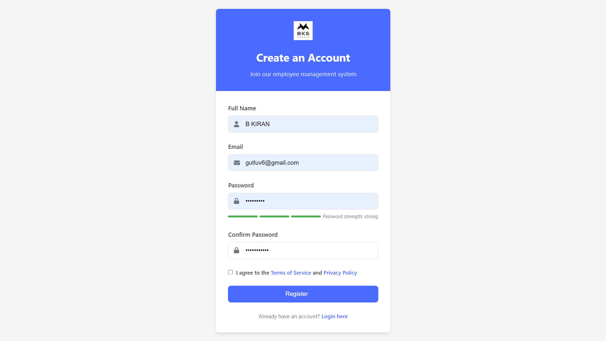
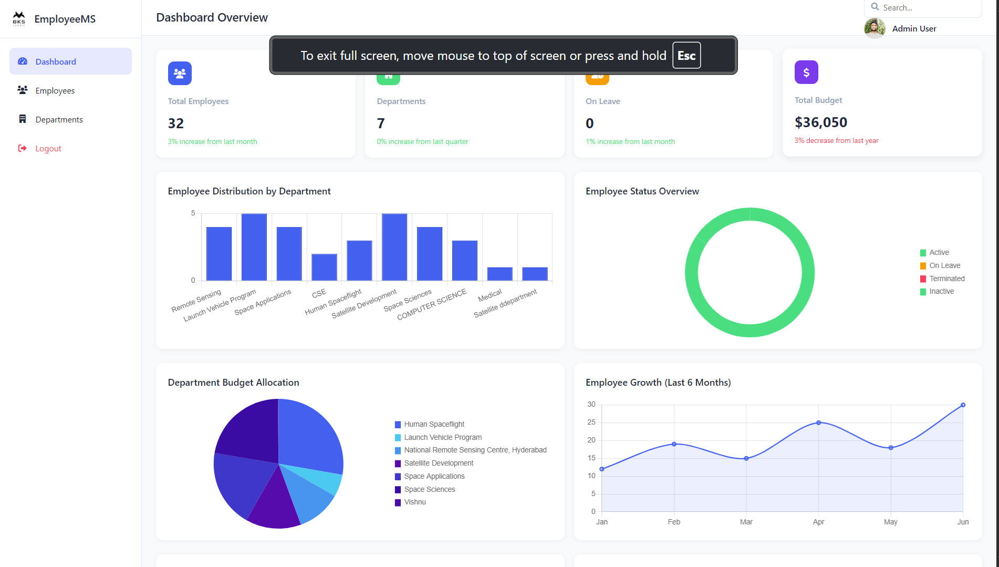
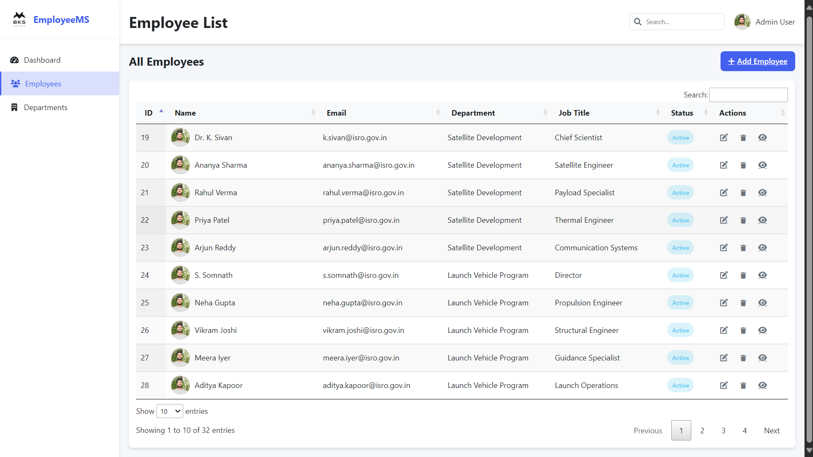

# 👨‍💼 Employee Management System - Java Full Stack Project

This is a **Java Full Stack Internship Project** developed as part of an internship at **JSpiders Development Center** (a unit of Test Yantra Software Solutions Pvt. Ltd). The project titled **Employee Management System** is a web-based application for managing employee data efficiently with modern features like authentication, role-based access, and real-time status tracking.

> 🔗 **Live Project:** [gect.medicomforts.com](http://gect.medicomforts.com)

---

## 🏢 Internship Certificate Details

> This is to certify that **Mr. B Kiran**, a *Bachelor of Engineering* student bearing USN: **2LG21CS005** from  
> **Government Engineering College, Talkal, Koppal**  
> has successfully completed an internship in **Java Full Stack** from **17th February 2025** to **24th May 2025**  
> under the guidance of **Mr. Shishira Bhat** at  
> **JSpiders Development Center**  
> *(A Unit of Test Yantra Software Solutions Pvt. Ltd)*.

---

## 🧑‍💻 Project Overview

The **Employee Management System** is a full-stack web application designed to help companies manage employee records and department-wise responsibilities.

### 📌 Key Features

- 🔐 User Authentication (Login/Register)
- 🧾 Add / Update / View / Delete Employee Records
- 🧑‍💼 Role-Based Access for Admins and Users
- 📊 Admin Dashboard for data visualization
- 🏢 Department & Job Role Management
- 🟢 Real-Time Employee Status Tracking
- 📱 Responsive and User-Friendly UI

---

## 🧰 Tech Stack Used

### 🖥️ Frontend
- HTML5
- CSS3
- JavaScript

### 💻 Backend
- Java (Servlets/JSP)
- PHP (used for APIs)
- MySQL (Database)

---

## 🗃️ Database Design

The system uses a normalized MySQL database with tables for:
- `employees` (ID, name, email, department, job_title, status, profile_image)
- `departments`
- `roles`
- `users` (for login system)

---

## 📷 Snapshots

> *Note: Below are static screenshots of the live hosted website.*

### 🟢 Login Page

---

### 🟢 Dashboard View

---

### 🟢 Employee Table View

---
